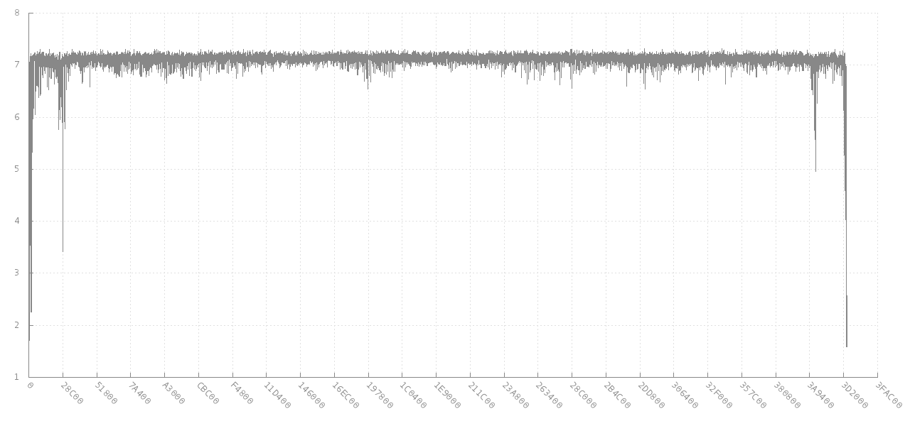
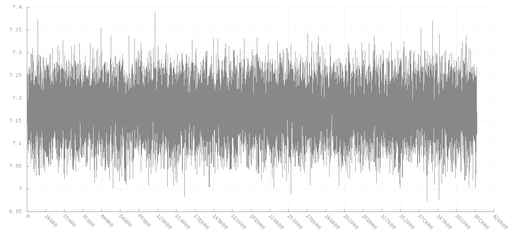
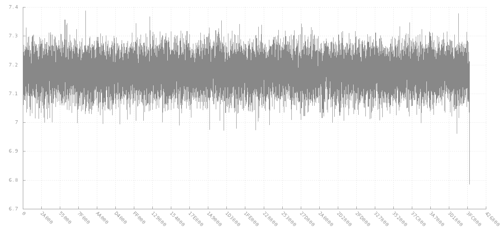
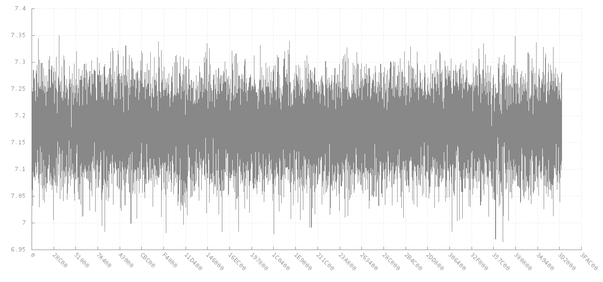

Entropy Examples
================

Herein you will find graphs showing entropy analysis graphs for different examples and data types. Entropy is the randomness of data when comparing bytes with neighbouring bytes. Entropy analysis code slides a window of N bytes across the data determining how different byte B is from byte B+1. This helps in determining if your target data is compressed, encrypted or finding keys and other distinctions.

``example.sh`` is used to generate. It utilizes [cyphunks libdisorder](https://github.com/cyphunk/libdisorder) branch (only adds a util to pipe a file through) and gnuplot.

Examples
========

Here is a sample of results. See repository for all samples.

Random 4MB JPEG

Random (``dd if=/dev/random of=random bs=1m count=4``)

Random Ziped. common zip meta data cause larger Y scale 

Random 4MB JPEG encrypted with RC2

License
=======

License: Non-White-Heterosexual-Male

If you are not a white heterosexual male you are permitted to copy, sell and use
this work in any manner you choose without need to include any attribution you
do not see fit. You are asked as a courtesy to retain this license in any
derivatives but you are not required. If you are a white heterosexual male you
are provided the same permissions (reuse, modification, resale) but are
required to include this license in any documentation and any public facing
derivative. You are also required to include attribution to the original author
or to an author responsible for redistribution of a derivative.

http://nonwhiteheterosexualmalelicense.org